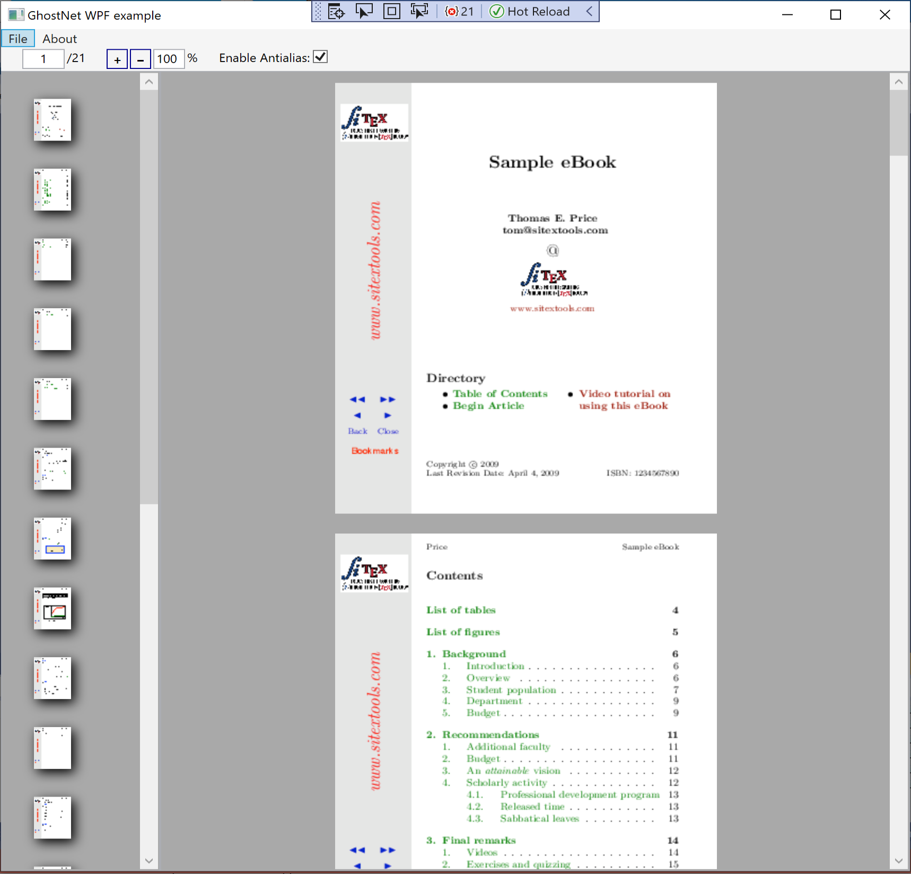

# C# overview

    

    

## About

In the [GhostPDL repository] a sample `C#` project can be found in `/demos/csharp`.

Within this project the following namespaces and corresponding `C#` files are of relevance:

- [GhostAPI] `ghostapi.cs`
- [GhostNET] `ghostnet.cs`
- [GhostMono] `ghostmono.cs`

## Platform & setup

### Building Ghostscript

Ghostscript should be built as a shared library for your platform.

See [Building Ghostscript].

## GhostAPI

`GhostAPI` is the main wrapper responsible for bridging over to the `C` library and ensuring that the correct DLLs are imported.

`GhostAPI` contains the `ghostapi` class which _does not_ need to be instantiated as it provides `public static` methods. These methods, which mirror their `C` counterparts, are as follows:

| Method | Description |
|---|---|
| [gsapi_revision] | Returns the revision numbers and strings of the Ghostscript interpreter library |
| [gsapi_new_instance] | Create a new instance of Ghostscript |
| [gsapi_delete_instance] | Destroy an instance of Ghostscript |
| [gsapi_set_stdio_with_handle] | Set the callback functions for `stdio`, together with the handle to use in the callback functions |
| [gsapi_set_stdio] | Set the callback functions for `stdio` |
| [gsapi_set_poll_with_handle] | Set the callback function for polling, together with the handle to pass to the callback function |
| [gsapi_set_poll] | Set the callback function for polling |
| [gsapi_set_display_callback] | _deprecated_ |
| [gsapi_register_callout] | This call registers a callout handler |
| [gsapi_deregister_callout] | This call deregisters a previously registered callout handler |
| [gsapi_set_arg_encoding] | Set the encoding used for the interpretation of all subsequent args supplied via the gsapi interface on this instance |
| [gsapi_set_default_device_list] | Set the string containing the list of default device names |
| [gsapi_get_default_device_list] | Returns a pointer to the current default device string |
| [gsapi_init_with_args] | Initialise the interpreter |
| [gsapi\_run\_\*][gsapi_run_wildcard] | Wildcard for various "run" methods |
| [gsapi_exit] | Exit the interpreter |
| [gsapi_set_param] | Set a parameter |
| [gsapi_get_param] | Get a parameter |
| [gsapi_enumerate_params] | Enumerate the current parameters |
| [gsapi_add_control_path] | Add a (case sensitive) path to one of the lists of permitted paths for file access |
| [gsapi_remove_control_path] | Remove a (case sensitive) path from one of the lists of permitted paths for file access |
| [gsapi_purge_control_paths] | Clear all the paths from one of the lists of permitted paths for file access |
| [gsapi_activate_path_control] | Enable/Disable path control |
| [gsapi_is_path_control_active] | Query whether path control is activated or not |

## GhostNET

`GhostNET` is the [.NET] interface into `GhostAPI`. It exemplifies how to do more complex operations involving multiple API calls and sequences.

### GhostNET WPF example

In `demos/csharp/windows/ghostnet.sln` there is a sample C# demo project.

This project can be opened in [Visual Studio] and used to test the Ghostscript API alongside a UI which handles opening PostScript and PDF files. The sample application here allows for file browsing and Ghostscript file viewing.

Below is a screenshot of the sample application with a PDF open:

## GhostMono

`GhostMono` is the [Mono] equivalent of `GhostNET` and as such has no dependancy on a Windows environment.

[Visual Studio]: https://visualstudio.microsoft.com
[GhostPDL repository]: https://github.com/ArtifexSoftware/ghostpdl
[GhostAPI]: #ghostapi
[GhostNET]: #ghostnet
[GhostMono]: #ghostmono
[Mono]: https://www.mono-project.com/
[.NET]: https://dotnet.microsoft.com/
[Building Ghostscript]: index.html#building-ghostscript

[gsapi_revision]: c-sharp-ghost-api#gsapi_revision
[gsapi_new_instance]: c-sharp-ghost-api#gsapi_new_instance
[gsapi_delete_instance]: c-sharp-ghost-api#gsapi_delete_instance
[gsapi_set_stdio_with_handle]: c-sharp-ghost-api#gsapi_set_stdio_with_handle
[gsapi_set_stdio]: c-sharp-ghost-api#gsapi_set_stdio
[gsapi_set_poll_with_handle]: c-sharp-ghost-api#gsapi_set_poll_with_handle
[gsapi_set_poll]: c-sharp-ghost-api#gsapi_set_poll
[gsapi_set_display_callback]: c-sharp-ghost-api#gsapi_set_display_callback
[gsapi_register_callout]: c-sharp-ghost-api#gsapi_register_callout
[gsapi_deregister_callout]: c-sharp-ghost-api#gsapi_deregister_callout
[gsapi_set_arg_encoding]: c-sharp-ghost-api#gsapi_set_arg_encoding
[gsapi_set_default_device_list]: c-sharp-ghost-api#gsapi_set_default_device_list
[gsapi_get_default_device_list]: c-sharp-ghost-api#gsapi_get_default_device_list
[gsapi_init_with_args]: c-sharp-ghost-api#gsapi_init_with_args
[gsapi_run_wildcard]: c-sharp-ghost-api#gsapi_run_wildcard
[gsapi_init_with_args]: c-sharp-ghost-api#gsapi_init_with_args
[gsapi_exit]: c-sharp-ghost-api#gsapi_exit
[gsapi_set_param]: c-sharp-ghost-api#gsapi_set_param
[gsapi_get_param]: c-sharp-ghost-api#gsapi_get_param
[gsapi_enumerate_params]: c-sharp-ghost-api#gsapi_enumerate_params
[gsapi_add_control_path]: c-sharp-ghost-api#gsapi_add_control_path
[gsapi_remove_control_path]: c-sharp-ghost-api#gsapi_remove_control_path
[gsapi_purge_control_paths]: c-sharp-ghost-api#gsapi_purge_control_paths
[gsapi_activate_path_control]: c-sharp-ghost-api#gsapi_activate_path_control
[gsapi_is_path_control_active]: c-sharp-ghost-api#gsapi_is_path_control_active
[gsapi_add_fs]: c-sharp-ghost-api#gsapi_add_fs
[gsapi_remove_fs]: c-sharp-ghost-api#gsapi_remove_fs
