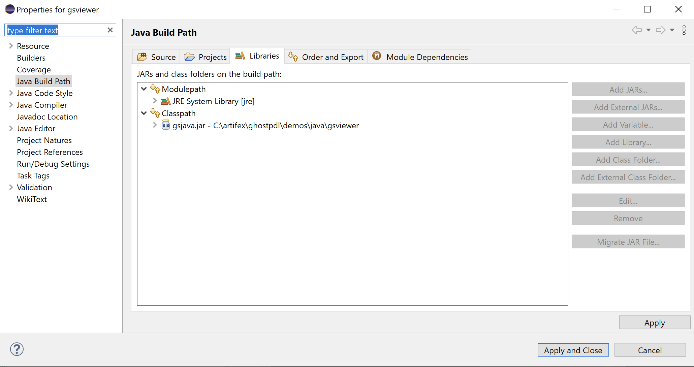

# Java overview

<div class="banner">
<div class="java-text"></div>
<div class="vendor-logo java-logo"></div>
</div>

## About


In the [GhostPDL repository] sample `Java` projects can be found in `/demos/java`.

Within this location the following folders are of relevance:

- [jni] `jni`
- [gsjava] `gsjava`
- [gstest] `gstest`
- [gsviewer] `gsviewer`


## Platform & setup


### Building Ghostscript

Ghostscript should be built as a shared library for your platform.

See [Building Ghostscript].

### jni: Building the Java Native Interface

Before building the JNI ensure that Ghostscript has already been built for your platform and that you have JDK installed.

The JNI is for use in the Java interface,
this object must be placed somewhere on your Java PATH. On Windows, the DLL
can be placed in the working directory, next to `gsjava.jar`.

| Platform | JNI file |
|---|---|
|Windows|`gs_jni.dll`|
|MacOS|`gs_jni.dylib`|
|Linux / OpenBSD|`gs_jni.so`|


#### Preparing your include folder

The build scripts require the header `jni.h`, which defines
all JNI functions, and `jni_md.h`, which defines all system-specific
integer types. The build scripts expect an include folder relative to their location which contain these header files from your system.

These headers are typically found in the following directories:


| Platform | jni.h | jni_md.h |
|---|---|---|
|Windows|`C:\Program Files\Java\<JDK Install>\include\jni.h`|`C:\Program Files\Java\<JDK Install>\include\win32\jni_md.h`|
|MacOS|`/Library/Java/JavaVirtualMachines/<JDK Install>/Contents/Home/include/jni.h`|`/Library/Java/JavaVirtualMachines/<JDK Install>/Contents/Home/include/darwin/jni_md.h`|
|Linux|`/lib/jvm/<JDK Install>/include/jni.h`|`/lib/jvm/<JDK Install>/include/linux/jni_md.h`|


Once your `include` folder has been located folder you can copy it and place it in your `ghostpdl/demos/java/jni/gs_jni` folder.

Your build scripts should now be ready to run as they will be able to find the required JNI header files in their own relative include folder.


#### Building on Windows

The `jni` folder contains a Visual Studio Solution file `/jni/gs_jni/gs_jni.sln` which you should use to build the required JNI `gs_jni.dll` library file.

With the project open in Visual Studio, select the required architecture from the drop down - then right click on 'gs_jni' in the solution explorer and choose "Build".

#### Building on MacOS

On your command line, navigate to `ghostpdl/demos/java/jni/gs_jni` and ensure that the build script is executable and then run it, with:

```
chmod +x build_darwin.sh
./build_darwin.sh
```

#### Building on Linux

On your command line, navigate to `ghostpdl/demos/java/jni/gs_jni` and ensure that the build script is executable and then run it, with:

```
chmod +x build_linux.sh
./build_linux.sh
```

### gsjava: Building the JAR


#### Building with the command line

Navigate to `ghostpdl/demos/java/gsjava` and use the following:

| Platform | Run file|
|---|---|
|Windows| `build_win32.bat` |
|MacOS| `build_darwin.sh` |
|Linux| `build_linux.sh` |

> **NOTE**<br>
> `gsjava` has a dependancy on [jni], please ensure that `gs_jni` is able to be built beforehand.

#### Building with Eclipse

Alternatively you can use [Eclipse] to build the JAR file.

Using [Eclipse] import the source folder `gsjava` as a project and select `Export > Java > JAR File` as shown in the screenshot example below:


#### Linking the JAR

The built JAR should be properly linked within your project Java Build Path as follows:



## Demo projects

### gstest

This project can be opened in [Eclipse] and used to test the Ghostscript API. The sample here simply sets up an instance of Ghostscript and then sets and gets some parameters accordingly.


### gsviewer

This project can be used to test the Ghostscript API alongside a UI which handles opening PostScript and PDF files. The sample application here allows for file browsing and Ghostscript file viewing.

Below is a screenshot of the sample application with a PDF open:


To run the project navigate to the `demos/java/gsviewer` location and ensure that the required libraries are in the directory:


| Platform | Ghostscript library file | JNI library file |
|---|---|---|
|Windows|`gpdldll64.dll`|`gs_jni.dll`|
|MacOS|`libgpdl.dylib`|`gs_jni.dylib`|
|Linux / OpenBSD|`libgpdl.so` (this may have been built as `libgs.so`, so it should be copied into this directory and renamed to `libgpdl.so`) |`gs_jni.so`|


#### Building on Windows

Run the `build_win32.bat` script.

#### Running on Windows

To run, open `gsviewer.jar` either through File Explorer or in the command line through the following command:

```
java -jar gsviewer.jar
```

#### Building on MacOS

On your command line, navigate to `ghostpdl/demos/java/gsviewer` and ensure that the build script is executable and then run it, with:

```
chmod +x build_darwin.sh
./build_darwin.sh
```

This will automatically build `gs_jni.dylib` (in the `ghostpdl/demos/java/jni/gs_jni/` location) and `gsjava.jar` `gsviewer.jar` in the `gsviewer` directory.

#### Running on MacOS

Ensure that the Ghostscript library exists in the `gsviewer` directory. (Copy and move the built library from `ghostpdl/sobin` as required).

Ensure that the run script is executable and then run it, with:

```
chmod +x start_darwin.sh
./start_darwin.sh
```

#### Building on Linux

On your command line, navigate to `ghostpdl/demos/java/gsviewer` and ensure that the build script is executable and then run it, with:

```
chmod +x build_linux.sh
./build_linux.sh
```

This will automatically build `gs_jni.so` (in the `ghostpdl/demos/java/jni/gs_jni/` location) and `gsjava.jar` `gsviewer.jar` in the `gsviewer` directory.

> **NOTE**<br>
> On Linux, when using OpenJDK, the property "assistive_technologies" may
need to be modified for the Java code to build. It can be modified by
editing the "accessibility.properties" file. This is located at:
>
> `/etc/java-8-openjdk/accessibility.properties`
>

#### Running on Linux

Ensure that the Ghostscript library exists in the `gsviewer` directory. (Copy and move the built library from `ghostpdl/sobin` as required).

Ensure that the run script is executable and then run it, with:

```
chmod +x start_linux.sh
./start_linux.sh
```


[jni]: #jni-building-the-java-native-interface
[gsjava]: #gsjava-building-the-jar
[gstest]: #gstest
[gsviewer]: #gsviewer
[Building Ghostscript]: index.html#building-ghostscript
[GhostPDL repository]: https://github.com/ArtifexSoftware/ghostpdl

[Eclipse]: https://www.eclipse.org/eclipseide/
