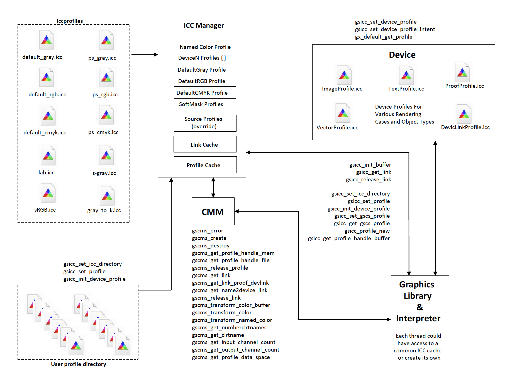
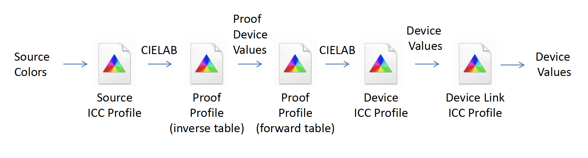
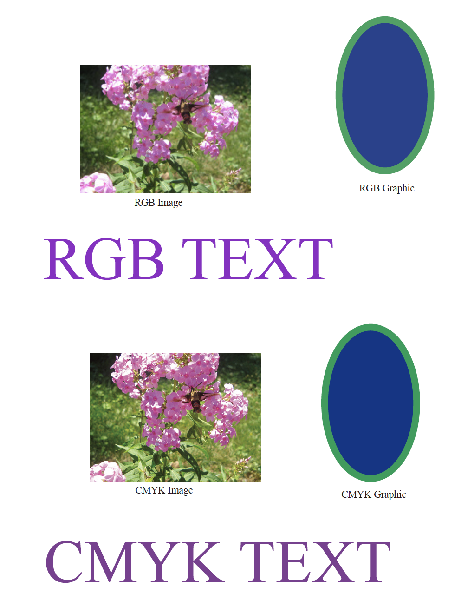
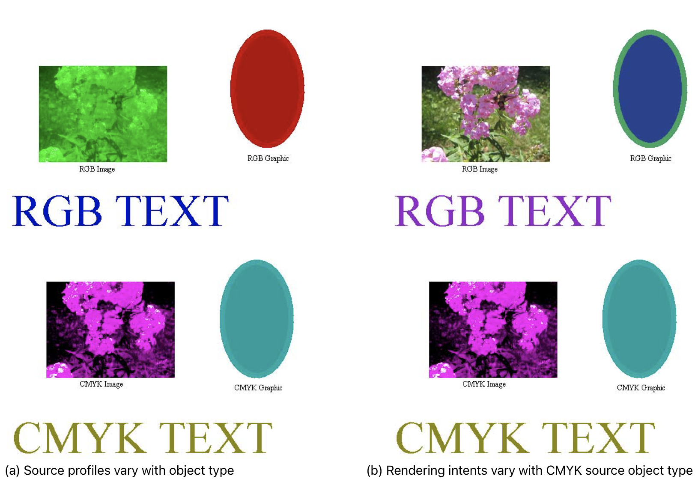
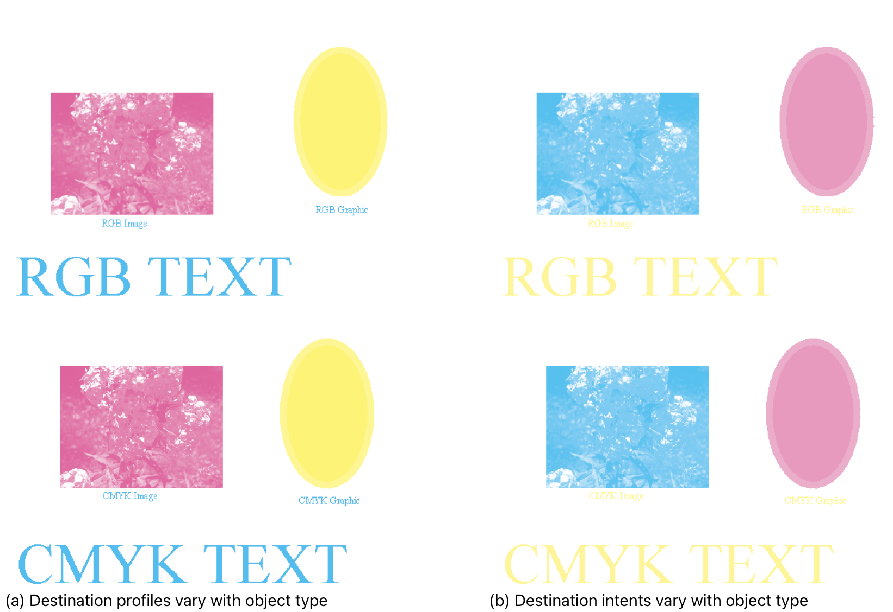
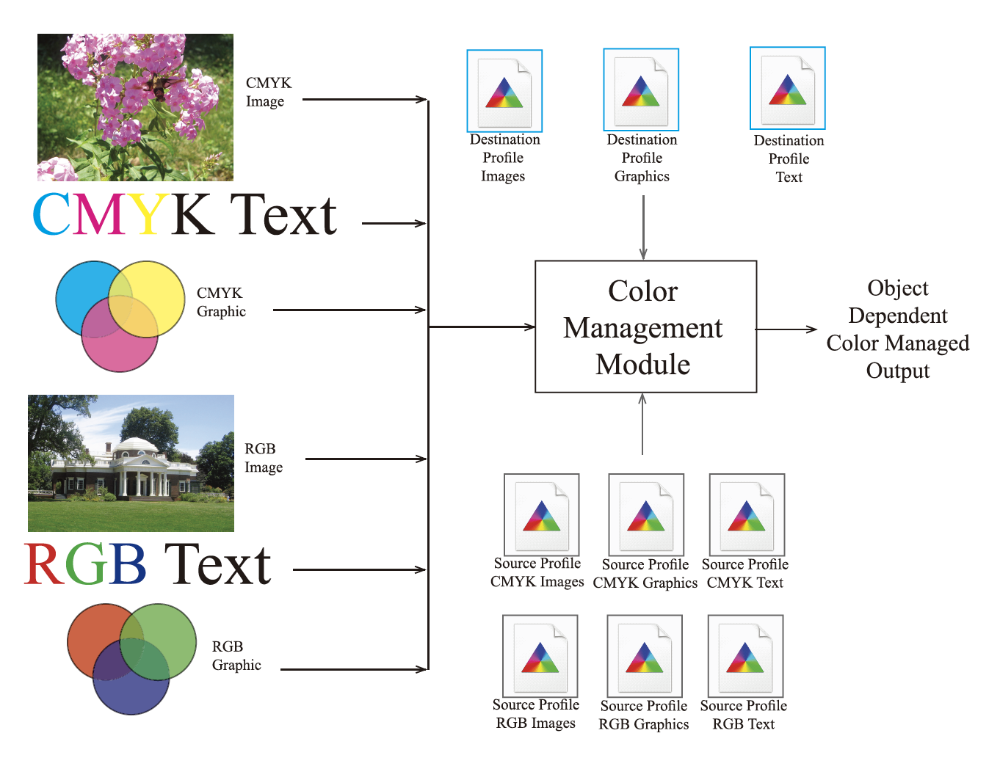
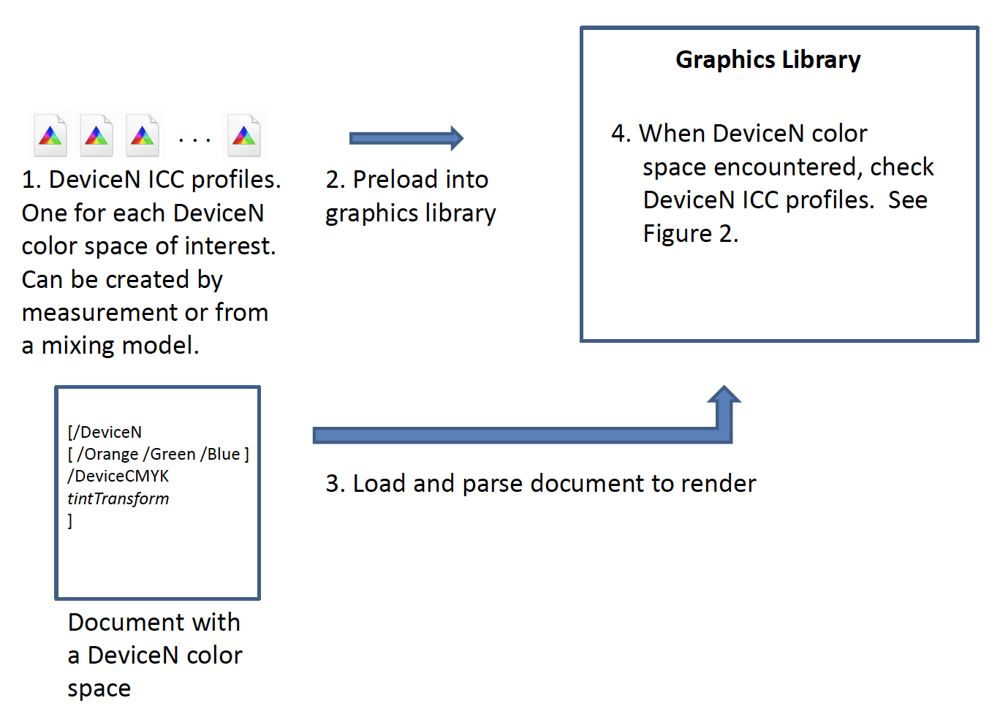

.. Copyright (C) 2001-2023 Artifex Software, Inc.
.. All Rights Reserved.

.. title:: Ghostscript Color Management

.. include:: header.rst

.. _GhostscriptColorManagement.html:

Ghostscript Color Management
=====================================================================

**Revision 1.66**

Author
---------------------------------------------

Michael J. Vrhel, Ph.D.

Artifex Software

39 Mesa Street, Suite 108A

San Francisco, CA 94129, USA

Abstract
---------------------------------------------

This document provides information about the color architecture in Ghostscript
9.54 and above. The document is suitable for users who wish to obtain accurate color with their
output device as well as for developers who wish to customize Ghostscript to achieve
a higher level of control and/or interface with a different color management module.

Introduction
---------------------------------------------

With release 9.0, the color architecture of Ghostscript was updated to primarily use the
ICC :ref:`[1]<footnote1>` format for its color management needs. Prior to this release, Ghostscript’s color
architecture was based heavily upon PostScript :ref:`[2]<footnote2>` Color Management (PCM). This is due to
the fact that Ghostscript was designed prior to the ICC format and likely even before there
was much thought about digital color management. At that point in time, color management
was very much an art with someone adjusting controls to achieve the proper output color.
Today, almost all print color management is performed using ICC profiles as opposed
to PCM. This fact along with the desire to create a faster, more flexible design was the
motivation for the color architectural changes in release 9.0. Since 9.0, several new features
and capabilities have been added. As of the 9.54 release, features of the color architecture
include:

- Easy to interface different CMMs (Color Management Modules) with Ghostscript.
- ALL color spaces are defined in terms of ICC profiles.
- Linked transformations and internally generated profiles are cached.
- Easily accessed manager for ICC profiles.
- Easy to specify default profiles for source DeviceGray, DeviceRGB and DeviceCMYK color spaces.
- Devices can readily communicate their ICC profiles and have their ICC profiles set.
- Operates efficiently in a multithreaded environment.
- Handles named colors (spots) with ICC named color profile or proprietary format.
- ICC color management of Device-N colors or alternatively customizable spot color handing.
- Includes object type (e.g. image, vector graphics, text), rendering intent and black point compensation into the computation of the linked transform.
- Ability to override document embedded ICC profiles with Ghostscript’s default ICC profiles.
- Easy to specify unique source ICC profiles to use with vector graphic, image and text objects.
- Easy to specify unique destination ICC profiles to use with vector graphic, image and text objects.
- Easy to specify different rendering intents (perceptual, colorimetric, saturation, absolute colorimetric) for vector graphic, image and text objects.
- Easy to specify different black point compensation settings for vector graphic, image and text objects.
- Ability to make use of a PDF output intent ICC profile.
- Ability to use an NCLR ICC output profile when rendering to a separation device.
- Control to force gray source colors to black ink only when rendering to output devices that support black ink.
- Ability to make use of device link ICC profiles for direct mapping of source colors to the device color space.
- Ability to make use of device link ICC profiles for retargeting from SWOP/Fogra standard color space to a specific device color space.
- Ability to monitor for the presence of color on individual pages, which is useful for certain print systems.
- Ability to specify different default transparency blending color spaces.
- Ability to specify a post rendering ICC profile for certain devices.
- Ability to accurately simulate overprinting with spot colors regardless of the output device color capabilities.

The document is organized to first provide a high level overview of the architecture. This
is followed by details of the various functions and structures, which include the information
necessary to interface other color management modules to Ghostscript as well as how to
interface specialized color handling operations.

Overall Architecture and Typical Flow
---------------------------------------------

:ref:`Figure 1<fig1>` provides a graphical overview of the various components that make up the architecture.
The primary components are:

- The ICC manager, which maintains the various default profiles.
- The link cache, which stores recently used linked transforms.
- The profile cache, which stores internally generated ICC profiles created from PostScript CIE based color spaces and CalRGB, CalGray PDF color spaces.
- The profiles contained in the root folder iccprofiles, which are used as default color spaces for the output device and for undefined source colors in the document.
- The color management module (CMM), which is the engine that provides and performs the transformations (e.g. little CMS).
- The profiles associated with the device, which include profiles dependent upon object type, a proofing profile and a device link profile.

In the typical flow, when a thread is ready to transform a buffer of data, it will request a
linked transform from the link cache. When requesting a link, it is necessary to provide
information to the CMM, which consists of a source color space, a destination color space,
an object state (e.g. text, vector graphic, or image), black point compensation setting and
a rendering type (e.g. perceptual, saturation, colorimetric). The linked transform provides
a mapping directly from the source color space to the destination color space. If a linked
transform for these settings does not already exist in the link cache, a linked transform from
the CMM will be obtained (assuming there is sufficient memory – if there is not sufficient
memory then the requesting thread will need to wait). Depending upon the CMM, it is
possible that the CMM may create a lazy linked object (i.e. create the real thing when
it is asked to transform data). At some point, a linked transform will be returned to the
requesting thread. The thread can then use this mapping to transform buffers of data
through calls through an interface to the external CMM. Once the thread has completed its
use of the link transform, it will notify the link cache. The link cache will then be able to
release the link when it needs additional cache space due to other link requests.

PDL Color Definitions and ICC Profiles
---------------------------------------------

To help reduce confusion, it is worthwhile to clarify terminology. In particular, the use of the
terms process color and device color need to be defined in the context of ICC profiles. Both
PDF :ref:`[3]<footnote3>` and PostScript (PS) have a distinction between process colors and device colors. In
PS, there is a conversion (e.g. via UCR/BG) from device colors to process colors. In an
ICC work flow, the colors are transformed directly from an input color space (often called
the source space) to an output color space (often called the destination space). The output
color space defined by the device’s ICC profile is a mapping to what PDF and PS define as
the process color space of the device. In other words, the “device color space” as defined by
the device’s ICC profile IS the process color space of PDF and PS. The ICC profile of the
device is a mapping from a CIE color space to the process color space AND from the process
color space to a CIE color space.

To understand this better, it may help to understand the method by which a print based
ICC profile is created. To create an ICC profile for a device, a chart is printed using its process
colors (e.g. CMYK). This chart is measured using a colorimeter or a spectrophotometer. This
provides the forward mapping from process colors to CIELAB values. The inverse mapping
(from CIELAB to process colors) is obtained by inverting this table usually through a brute
force search and extrapolation method. These mappings are both packed into an ICC format,
thereby defining mappings between the device “process colors” and the CIE color space.

Usage
---------------------------------------------

There are a number of command line options available for color control. These options are
also available as device parameters and so can be set from Ghostscript’s command prompt
when Ghostscript is used in “server-mode” operation.

To define source colors that are not already colorimetrically defined in the source document,
the following command line options can be invoked:

    ``-sDefaultGrayProfile = my_gray_profile.icc``

    ``-sDefaultRGBProfile = my_rgb_profile.icc``

    ``-sDefaultCMYKProfile = my_cmyk_profile.icc``

In this case, for example, any Device Gray source colors will be interpreted as being defined
by the ICC profile ``my_gray_profile.icc``. If these profiles are not set, default ICC profiles
will be used to define undefined colors. These default profiles are contained in the directory
iccprofiles and are named ``default_gray.icc``, ``default_rgb.icc`` and ``default_cmyk.icc``. The
profile ``default_gray.icc`` is defined to provide output along the neutral axis with an sRGB
linearization. The profile ``default_rgb.icc`` is the V2 sRGB ICC profile and the profile ``default_cmyk.icc`` is a SWOP CMYK ICC profile.

It is possible to have Ghostscript use the above specified ICC profiles in place of ICC
profiles embedded in the document. This is achieved using:

    ``-dOverrideICC = true/false``

which, when set to true overrides any ICC profiles contained in the source document with
the profiles specified by ``DefaultGrayProfile``, ``DefaultRGBProfile``, ``DefaultCMYKProfile``. Note
that if no profiles are specified for the default Device color spaces, then the system default
profiles will be used for ``DeviceGray``, ``DeviceRGB`` and ``DeviceCMYK`` source colors.

For detailed override control in the specification of source colors see ``SourceObjectICC``.
In addition to being able to define undefined source colors, it is possible to define the
ICC profile for the output device using:

    ``-sOutputICCProfile = my_device_profile.icc``

Care should be taken to make sure that the number of components associated with the output
device is the same as the number of components for the output device ICC profile (i.e. use an
RGB profile for an RGB device). If the destination device is CMYK + SPOT colorants, then
it is possible to specify either a CMYK ICC profile or an N-Color ICC profile for the device.
If a CMYK profile is specified, then only the CMYK colorants will be color managed. If
an output profile is not specified, then the default CMYK profile is used as the output profile.
If an N-Color (NCLR) ICC profile is specified for the output device (valid for ``tiffsep`` and
``psdcmyk`` devices), then it is possible to specify the name of the colorants in the profile. This
specification is done using:

    ``-sICCOutputColors="Cyan, Magenta, Yellow, Black, Orange, Violet"``

where the colorants listed are shown as an example. The list of the colorant names must
be in the order that they exist in the profile. Note that if a colorant name that is specified
for the profile occurs also within the document (e.g. "Orange" above), then these colorants
will be associated with the same separation. It is possible through a compile time option
``LIMIT_TO_ICC`` defined in ``gdevdevn.h`` to restrict the output colorants of the ``psdcmyk`` and
``tiffsep`` device to the colorants of the ICC profile or to allow additional spot colorants in the
document to be created as different separations. If restricted, the other spot colorants will
go through the alternate tint transform and then be mapped to the color space defined by
the N-CLR profile.

Note that if an NCLR profile is specified for the device and ``-sICCOutputColors`` is not
specified, then the assumption will be that the first four colorants in the profile are cyan,
magenta, yellow and black and the remaining spot colors will be named using the form
*ICC_COLOR_i* where ``i`` is an index from 0 to the number of spot colors in the profile minus
one.

A directory can be defined, which will be searched to find the above defined ICC profiles.
This makes it easier for users who have their profiles contained in a single directory and do
not wish to append the full path name in the above command line options. The directory is
set using:

    ``-sICCProfilesDir = c:/my_icc_profiles``

Note that if the build of gs or other PDL languages is performed with ``COMPILE_INITS=1``,
then the profiles contained in ``gs/iccprofiles`` will be placed in the ROM file system. If a
directory is specified on the command line using ``-sICCProfilesDir=``, that directory is searched
before the ``iccprofiles/`` directory of the ROM file system is searched.

Named color support for separation color spaces is specified through the command line
option:

    ``-sNamedProfile = c:/my_namedcolor_structure``

While the ICC specification does define a named color format, the above structure can in
practice be much more general for those who have complex handling requirements of separation
color spaces. For example, some developers wish to use their own proprietary-based
format for spot color management. This command option is for developer use when an implementation
for named color management is designed for the function ``gsicc_transform_named_color``
located in ``gsicc_cache.c`` . An example implementation is currently contained in the code
[see comments above ``gsicc_transform_named_color`` in ``gsicc_cache.c``]. For the general
user, this command option should really not be used.

The above option deals with the handling of single spot (Separation) colors as well as
with DeviceN colors. An example of its use for DeviceN and Separation colors is given
in ``gs/toolbin/color/named_color``, where you will want to use the command line option:

    ``sNamedProfile=named_color_table.txt``

It is also possible to specify ICC profiles for managing DeviceN source colors. This is
done using the command line option:

    ``-sDeviceNProfile = c:/my_devicen_profile.icc``

Note that neither PS nor PDF provide in-document ICC profile definitions for DeviceN color
spaces. With this interface it is possible to provide this definition. The colorants tag order in
the ICC profile defines the lay-down order of the inks associated with the profile. A windows based
tool for creating these source profiles is contained in ``gs/toolbin/color/icc_creator``. If
non-ICC based color management of DeviceN source colors is desired by a developer, it is
possible to use the same methods used for the handling of individual spot colors as described
above.

The command line option:

    ``-sProofProfile = my_proof_profile.icc``

enables the specification of a proofing profile, which will make the color management system
link multiple profiles together to emulate the device defined by the proofing profile. See :ref:`this section<proof_and_device-link_profiles>` for details on this option.

The command line option:

    ``-sDeviceLinkProfile = my_link_profile.icc``

makes it possible to include a device link profile in the color transformations. This is useful
for work flows where one wants to map colors first to a standard color space such as SWOP or
Fogra CMYK, but it is desired to redirect this output to other CMYK devices. See :ref:`this section<proof_and_device-link_profiles>` for details on this option.

It is possible for a document to specify the rendering intent to be used when performing a
color transformation. Ghostscript is set up to handle four rendering intents with the nomenclature
of Perceptual, Colorimetric, Saturation, and Absolute Colorimetric, which matches
the terminology used by the ICC format. By default, per the specification, the rendering
intent is Relative Colorimetric for PDF and PS documents. In many cases, it may be desired
to ignore the source settings for rendering intent. This is achieved through the use of:

    ``-dRenderIntent = intent``

which sets the rendering intent that should be used with the profile specified above by -
``sOutputICCProfile``. The options for intent are 0, 1, 2 and 3, which correspond to the ICC
intents of Perceptual, Colorimetric, Saturation, and Absolute Colorimetric.

Similarly, it is possible to turn off or on black point compensation for the color managed
objects in the document. Black point compensation is a mapping performed near the black
point that ensures that the luminance black in a source color space is mapped to the luminance
black in a destination color space with adjustments to ensure a smooth transition
for near black colors. The mapping is similar to the mapping performed at the white point
between devices. With black point compensation enabled, potential loss of detail in the
shadows is reduced. By default, Ghostscript has black point compensation enabled. However,
note that the PDF 2.0 specification adds a black point compensation member to the
extended graphic state. As such, it is possible that the document could turn off black point
compensation. If this is not desired, it is possible to force black point compensation to a
particular state using:

    ``-dBlackPtComp = 0 / 1``

where 0 implies compensation is off and 1 implies that compensation if on. Integer values
were used instead of boolean for this command to enable easy expansion of the option to
different types of black point compensation methods.

It is also possible to make use of the special black preserving controls that exist in :title:`littleCMS`.

The command line option:

    ``-dKPreserve = 0 / 1 / 2``

specifies if black preservation should be used when mapping from CMYK to CMYK. When
using :title:`littleCMS` as the CMM, the code 0 corresponds to no preservation, 1 corresponds to
the ``PRESERVE_K_ONLY`` approach described in the :title:`littleCMS` documentation and 2 corresponds
to the ``PRESERVE_K_PLANE`` approach. See the `lcms users manual`_ for details
on what these options mean.

Ghostscript currently provides overprint simulation for spot colorants when rendering to
the separation devices ``psdcmyk`` and ``tiffsep``. These devices maintain all the spot color planes
and merge these together to provide a simulated preview of what would be printed. Work
is currently under development to provide overprint simulation to the other devices through
the use of an intermediate compositing device.
There are three additional special color handling options that may be of interest to some
users. One is:

    ``-dDeviceGrayToK = true/false``

By default, Ghostscript will map DeviceGray color spaces to pure K when the output device
is CMYK based. The ``gray_to_k.icc`` profile in ``./profiles`` is used to achieve this mapping of
source gray to the colorant K. The mapping of gray to K may not always be desired. In particular,
it may be desired to map from the gray ICC profile specified by ``-sDefaultGrayProfile``
to the output device profile. To achieve this, one should specify ``-dDeviceGrayToK=false``.

In certain cases, it may be desired to not perform ICC color management on ``DeviceGray``,
``DeviceRGB`` and ``DeviceCMYK`` source colors. This can occur in particular if one is attempting
to create an ICC profile for a target device and needed to print pure colorants. In this
case, one may want instead to use the traditional Postscript 255 minus operations to convert
between RGB and CMYK with black generation and undercolor removal mappings. To achieve these types of color mappings use the following command set to true:

    ``-dUseFastColor = true/false``

Output Intents and Post Rendering Color Management
~~~~~~~~~~~~~~~~~~~~~~~~~~~~~~~~~~~~~~~~~~~~~~~~~~~~~~~~

PDF documents can contain target ICC profiles to which the document is designed to be
rendered. These are called output intents within the PDF specification. It is possible to
make use of these profiles with the use of the command line option:

    ``-dUsePDFX3Profile = int``

If this option is included in the command line, source device color values (e.g ``DeviceCMYK``,
``DeviceRGB``, or ``DeviceGray``) that match the color model of the output intent
will be interpreted to be in the output intent color space. In addition, if the output device
color model matches the output intent color model, then the destination ICC profile will be
the output intent ICC profile. If there is a mismatch between the device color model and
the output intent, the output intent profile will be used as a proofing profile, since that is
the intended rendering. Note that a PDF document can have multiple rendering intents per
the PDF specification. As such, with the option ``-dUsePDFX3Profile`` the first output intent
encountered will be used. It is possible to specify a particular output intent where int is an
integer (a value of 0 is the same as not specifying a number). Probing of the output intents
for a particular file is possible using ``extractICCprofiles.ps`` in ``./gs/toolbin``. Finally, note that
the ICC profile member entry is an option in the output intent dictionary. It is possible
for the output intent dictionary to specify a registry and a standard profile (e.g. Fogra39)
instead of providing a profile. Ghostscript will not make use of these output intents. Instead,
if desired, these standard profiles should be used with the commands specified above
(e.g. ``-sOutputICCProfile``). Note that it is possible that a rendering intent can be an NCLR
profile. In this case, it is necessary to ensure that the device can handle such a profile (e.g.
the ``psdcmyk`` and ``tiffsep`` devices). In addition, the colorant names should be specified using ``-sICCOutputColors``.

When using the output intent, but going to an output color space that is different than
the actual intent, it may be desirable to apply an ICC transformation on the rendered output
buffer. For example, it may be necessary to render to the output intent ICC profile color
space to ensure proper color blending, overprinting and that other complex operations occur
as intended by the document author. Once the document is rendered, we would want to
transform to the color space defined for our actual output device. The ``tiffscaled`` devices as
well as the ``tiffsep`` device allow the specification of a post render ICC profile to achieve this.

The command line option is made using:

    ``-sPostRenderProfile = my_postrender_profile.icc``

Note that this allows for the cases where the output intent color space of the document
is CMYK based while the output device is RGB based. In such a situation we would use a
``PostRenderProfile`` that was RGB based.

Transparency and Color Management
~~~~~~~~~~~~~~~~~~~~~~~~~~~~~~~~~~~~~~~~~~~~~~~~~~~~~~~~

Transparency blending in PDF can be dependent upon the color space in which the blending
takes place. In certain source files, the color space for which the blending is to occur is not
specified. Per the specification, when this occurs, the color space of the target device should
be used. For consistent output across different device types this is not always desirable. For
this reason, Ghostscript provides the capability to specify the desired default blending color
space through the command line option:

    ``-sBlendColorProfile = my_blend_profile.icc``

When this option is used, if a source file has transparency blending the blending result should
not depend upon the output device color model.

Ghostscript has the capability to maintain object type information even through transparency
blending. This is achieved through the use of a special tag plane during the blending
of the objects. When the final blending of the objects occurs this tag information is available.
Mixed objects will be indicated as such (e.g text blended with image). A device can have
a specialized ``put_image`` operation that can handle the pixel level color management operation
and apply the desired color mapping for different blend cases. The ``bittagrgb`` device in
Ghostscript provides a demonstration of the use of the tag information.

.. _proof_and_device-link_profiles:

Proof and Device-Link Profiles
~~~~~~~~~~~~~~~~~~~~~~~~~~~~~~~~~~~~~~~~~~

As shown in  :ref:`Figure 1<fig1>`, the proofing profile and the device link profile are associated with the
device. If these profiles have been specified using the options ``-sProofProfile = my_proof_profile.icc``
and ``-sDeviceLinkProfile = my_link_profile.icc``, then when the graphics library maps a source
color defined by the ICC profile ``source.icc`` to the device color values, a transformation is
computed by the CMM that consists of the steps shown in :ref:`Figure 2<fig2>`. In this Figure, Device
ICC Profile is the ICC profile specified for the actual device (this can be specified using
``-sOutputICCProfile``). In practice, the CMM will create a single mapping that performs the
transformation of the multiple mappings shown in :ref:`Figure 2<fig2>`. If we specify a proofing profile,
then our output should provide a proof of how the output would appear if it had been
displayed or printed on the proofing device defined by the proofing profile. The device link profile is useful for cases where one may have a work flow that consists of always rendering to a common CMYK space such as Fogra 39 followed by a mapping with a specialized device
link profile. In this case, the profile specified by ``-sOutputICCProfile`` would be the profile for
the common CMYK space.

Note that if ``-sSourceObjectICC`` is used to specify device link ICC profiles to map from
source color spaces to device colors, then it is not possible to use either the device profile or
the proofing profile for these objects. However, a device link profile that is associated with
the target device will be merged with the device link profile specified for the source object.

Object dependent color management
~~~~~~~~~~~~~~~~~~~~~~~~~~~~~~~~~~~~~~~~~~~~~~~~~~~~~~~~

It is often desired to perform unique mappings based upon object types. For example, one
may want to perform one color transformation on text colors to ensure a black text and
a different transformation on image colors to ensure perceptually pleasing images and yet
another transformation on graphics to create saturated colors. To achieve this, Ghostscript
provides an unprecedented amount of color control based upon object type.
The following commands, enable one to specify unique output ICC profiles, rendering
intents, black point compensation and black preserving methods for text, vector graphic,
and image objects. As shown in  :ref:`Figure 1<fig1>`, these profiles are stored in the device structure.

Specifically, the command options are:

    ``-sVectorICCProfile = filename``
        Sets the ICC profile that will be associated with the output device for vector graphics (e.g.
        solid color Fill, Stroke operations). This option can be used to obtain more saturated colors
        for graphics. Care should be taken to ensure that the number of colorants associated with
        the device is the same as the profile.

    ``-dVectorIntent = intent``
        Sets the rendering intent that should be used with the profile specified above by ``-sVectorICCProfile``. The options are the same as specified for ``-dRenderIntent``.

    ``-dVectorBlackPt = 0 / 1``
        Sets the black point compensation setting that should be used with the profile specified
        above by ``-sVectorICCProfile``.

    ``-dVectorKPreserve = 0 / 1 / 2``
        Specifies the black preserving method that should be used from mapping CMYK to CMYK for vector graphic objects. The options are the same as specified for ``-dKPreserve``.

    ``-sImageICCProfile = filename``
        Sets the ICC profile that will be associated with the output device for images. This can
        be used to obtain perceptually pleasing images. Care should be taken to ensure that the
        number of colorants associated with the device is the same as the profile.

    ``-dImageIntent = intent``
        Sets the rendering intent that should be used with the profile specified above by ``-sImageICCProfile``.
        The options are the same as specified for ``-dRenderIntent``.

    ``-dImageBlackPt = 0 / 1``
        Sets the black point compensation setting that should be used with the profile specified
        above by ``-sImageICCProfile``.

    ``-dImageKPreserve = 0 / 1 / 2``
        Specifies the black preserving method that should be used from mapping CMYK to CMYK
        for image objects. The options are the same as specified for ``-dKPreserve``.

    ``-sTextICCProfile = filename``
        Sets the ICC profile that will be associated with the output device for text. This can be
        used ensure K only text at the output. Care should be taken to ensure that the number of
        colorants associated with the device is the same as the profile.

    ``-dTextIntent = intent``
        Sets the rendering intent that should be used with the profile specified above by ``-sTextICCProfile``.
        The options are the same as specified for ``-dRenderIntent``.

    ``-dTextBlackPt = 0 / 1``
        Sets the black point compensation setting that should be used with the profile specified
        above by ``-sTextICCProfile``.

    ``-dTextKPreserve = 0 / 1 / 2``
        Specifies the black preserving method that should be used from mapping CMYK to CMYK
        for text objects. The options are the same as specified for ``-dKPreserve``.
        In addition to being able to have the output ICC profile dependent upon object type, it
        is possible to have the source ICC profile and rendering intents be dependent upon object
        types for GRAY, RGB and CMYK objects. Because this requires the specification of many
        new parameters and is only used in specialized situations, the specification is made through
        a single text file. The text file is specified to Ghostscript using:

    ``-sSourceObjectICC = filename``
        This option provides an extreme level of override control to specify the source color
        spaces, rendering intents and black point compensation to use with vector graphics, images
        and text for source objects. The specification is made through a file that contains on a line,
        a key name to specify the object type (e.g. ``Image_CMYK``) followed by an ICC profile file
        name, a rendering intent number (0 for perceptual, 1 for colorimetric, 2 for saturation, 3 for
        absolute colorimetric), a black point compensation value (0 or 1), a boolean to indicate if
        source ICC profiles should be overridden, and a value for the CMYK objects to indicate if any
        type of black preservation should be used when going from CMYK to CMYK transformations.
        An example file is given in ``./gs/toolbin/color/src_color/objsrc_profiles_example.txt``.
        Profiles to demonstrate this method of specification are also included in this folder. Note
        that if objects are colorimetrically specified through this mechanism, other operations like
        ``-sImageIntent``, ``-dOverrideICC``, have no affect.

        The example file mentioned above contains the following tab delimited lines:

        .. code-block:: bash

            Vector_CMYK     cmyk_src_cyan.icc       0   1   0     0
            Image_CMYK      cmyk_src_magenta.icc    0   1   0     0
            Text_CMYK       cmyk_src_yellow.icc     0   1   0     0
            Vector_RGB      rgb_source_red.icc      0   1   0
            Image_RGB       rgb_source_green.icc    0   1   0
            Text_RGB        rgb_source_blue.icc     0   1   0

        where the first item in the line is the key word, the second item in the line is the file name
        of the source ICC profile to use for that object type, the third item specifies the rendering
        intent, the fourth item specifies the black point compensation setting, the fifth term indicates
        if source ICC profiles should be overridden, and the sixth term which should only be there
        for CMYK source objects indicates if any type of black preservation should be performed if we are going to a CMYK color space. Note that not all types need to be specified. It is possible to have only a single type specified in the file (e.g. ``Image_CMYK``). The other items would render in a normal default fashion in this case. Note that it is necessary to include all the possible options in each line. That is, ``Vector_CMYK cmyk_src_cyan.icc 0`` is not a valid line but must include settings for the next three values as given above for ``Vector_CMYK``. In addition to CMYK and RGB types given above, the user can also specify ``Vector_GRAY``, ``Image_GRAY`` and ``Text_GRAY`` objects.

    In addition, it is possible to have unique color management methods for these object
    types through two special names which are “None” and “Replace”. For example, if our file
    contained the following two lines:

    ``Vector_CMYK None``

    ``Text_CMYK Replace``

    then vector graphic CMYK source objects will not be color managed but instead will go
    through the standard Postscript mapping methods (e.g. 255-X). CMYK text objects will go
    through the color replacement color management route which is provided for those developers
    who wish to provide direct output replacement colors for a given incoming source color. This
    is currently implemented in the function ``gsicc_rcm_transform_general``, which is in the file
    ``gsicc_replacecm.c``. The current implementation computes the color negative of the source
    color as a demonstration. Note that the replaced color should be in the device’s color space. The entire contents of the file, ``gsicc_replacecm.c`` are provided as an example for developers.

    In addition, one can specify a device link ICC profile to use with a particular source
    object type when mapping to the destination color space. This is done by simply using a
    notation such as:

    ``Vector_RGB linkRGBtoCMYK.icc 0 1 0``

    in the ``-sSourceObjectICC`` file, where ``linkRGBtoCMYK.icc`` is the device link ICC profile file
    name. Note that the rendering intent etc are still specified but their effect is dependent upon
    the CMM that is hooked in with Ghostscript. With the current use of lcms_, these values
    have no effect with device link profiles. Note also that if the device ICC profile is an NCLR
    profile, it is possible that the device link profiles specified in the ``-sSourceObjectICC`` file can
    have a destination color space that is either CMYK or NCLR.

    For those interested in this level of control, it is recommended to execute a number
    of examples. In the first example, copy the files in ``./gs/toolbin/color/src_color/`` to ``./iccprofiles``
    and render the file ``./examples/text_graph_image_cmyk_rgb.pdf`` with the option
    ``-sSourceObjectICC = objsrc_profiles_example.txt`` to an RGB device (e.g. ``tiff24nc``). Note,
    to ensure that Ghostscript can find all the files and to avoid having to do a full rebuild to
    create the ROM file system, you may want to specify the icc directory using:

    ``-sICCProfilesDir=“your_full_path_to_iccprofiles/"``

    , which provides the full path to ``./iccprofiles/``. Windows users should be sure to use the forward slash delimiter due to the
    special interpretation of ``\`` by the Microsoft C startup code.

    :ref:`Figure 3<fig3>` displays the source file ``text_graph_image_cmyk_rgb.pdf`` rendered with default
    settings and :ref:`Figure 4a<fig4>` displays the result when rendered using ``-sSourceObjectICC = objsrc_profiles_example.txt``. The profiles specified in ``objsrc_profiles_example.txt`` are designed to render object types to the color specified in their name when used as a source
    profile. In this case, RGB vector graphics, images and text are rendered red, green and blue
    respectively and CMYK vector graphics, images and text are rendered cyan, magenta and
    yellow respectively.

    Modifying the contents of the ``objsrc_profiles_example.txt`` file to:

    .. code-block:: bash

        Vector_CMYK     cmyk_src_renderintent.icc   0   1   0   0
        Image_CMYK      cmyk_src_renderintent.icc   1   1   0   0
        Text_CMYK       cmyk_src_renderintent.icc   2   1   0   0

    and rendering the file ``./examples/text_graph_image_cmyk_rgb.pdf`` to an RGB device, one
    obtains the output shown in :ref:`Figure 4b<fig4>`. In this case, we demonstrated the control of rendering intent based upon object type. The profile ``cmyk_src_renderintent.icc`` is designed to create significantly different colors for its different intents. Since we only specified this for the CMYK objects we see that they are the only objects effected and that this profile renders its perceptual intent cyan, its colorimetric intent magenta and its saturation intent yellow.

    For another example of object dependent color management, copy the files in ``./toolbin/color/icc_creator/effects`` to ``./iccprofiles``. Now specify unique output ICC profiles for different object types using the command line options:

    ``-sVectorICCProfile = yellow_output.icc``

    ``-sImageICCProfile = magenta_output.icc``

    ``-sTextICCProfile = cyan_output.icc``

    while rendering the file ``text_graph_image_cmyk_rgb.pdf`` to a CMYK device (e.g. ``tiff32nc``).

    :ref:`Figure 5a<fig5>` displays the results. In this case, the profiles, ``cyan_output.icc``, ``yellow_output.icc``
    and ``magenta_output.icc`` render a color that is indicated by their name when used as an output profile.

    Finally, in yet another example, we can demonstrate the effect of rendering intent for
    different objects using the command line options:

    ``-sVectorICCProfile = cmyk_des_renderintent.icc``

    ``-sImageICCProfile = cmyk_des_renderintent.icc``

    ``-sTextICCProfile = cmyk_des_renderintent.icc``

    ``-dImageIntent = 0``

    ``-dVectorIntent = 1``

    ``-dTextIntent = 2``

    :ref:`Figure 5b<fig5>` displays the result. The profile ``cmyk_des_renderintent.icc`` is designed such
    that the perceptual rendering intent outputs cyan only, the colorimetric intent outputs magenta
    only and the saturation intent outputs yellow only.

    A graphical overview of the object dependent color control is shown in :ref:`Figure 6<fig6>`, which
    shows how both the source and/or the destination ICC profiles can be specified.

Details of objects and methods
----------------------------------------

At this point, let us go into further detail of the architecture and in particular the various
functions that may be of interest to those wishing to work with ICC profiles within
Ghostscript. Following this, we will discuss the requirements for interfacing another CMM
to Ghostscript as well as details for customization of handling Separation and DeviceN color
spaces.

ICC Manager
~~~~~~~~~~~~~~~~~~~~~~~~~~~~

The ICC Manager is a reference counted member variable of Ghostscript’s imager state. Its functions are to:

- Store the required profile information to use for Gray, RGB, and CMYK source colors that are NOT colorimetrically defined in the source document. These entries must always be set in the manager and are set to default values unless defined by the command line interface.
- Store the optional profile/structure information related to named colors and DeviceN colors.
- Store the CIELAB source profile.
- Store the specialized profile for mapping gray source colors to K-only CMYK values.
- Store settings for profile override, output rendering intent (i.e. perceptual, colorimetric, saturation or absolute colorimetric) and source color rendering intents.
- Store the profiles that are used for softmask rendering if soft masks are contained in the document.
- Store the profiles used for object dependent source color specification through the use of ``-sSourceObjectICC``.
- Store the boolean flags for profile and rendering intent override of source settings.

The manager is created when the imaging state object is created for the graphics library.
It is reference counted and allocated in garbage collected (GC) memory that is stable with
graphic state restores. The default GRAY, RGB and CMYK ICC color spaces are defined
immediately during the initialization of the graphics library. If no ICC profiles are specified
externally, then the ICC profiles that are contained in the root folder iccprofiles will be used.
The ICC Manager is defined by the structure given below.

.. code-block:: c

    typedef struct gsicc_manager_s {
        cmm_profile_t *device_named; /* The named color profile for the device */
        cmm_profile_t *default_gray; /* Default gray profile for device gray */
        cmm_profile_t *default_rgb; /* Default RGB profile for device RGB */
        cmm_profile_t *default_cmyk; /* Default CMYK profile for device CMKY */
        cmm_profile_t *lab_profile; /* Colorspace type ICC profile from LAB to LAB */
        cmm_profile_t *xyz_profile; /* RGB profile that hands back CIEXYZ values */
        cmm_profile_t *graytok_profile; /* A specialized profile for mapping gray to K */
        gsicc_devicen_t *device_n; /* A linked list of profiles for DeviceN support */
        gsicc_smask_t *smask_profiles; /* Profiles used when we are in a softmask group */
        bool override_internal; /* Set via the user params */
        cmm_srcgtag_profile_t *srcgtag_profile; /* Object dependent source profiles */
        gs_memory_t *memory;
        rc_header rc;
    } gsicc_manager_t;

Operators that relate to the ICC Manager are contained in the file ``gsicc_manage.c/h`` and include the following:

``gsicc_manager_t* gsicc_manager_new(gs_memory_t *memory);``
    Creator for the ICC Manager.

``int gsicc_init_iccmanager(gs_state * pgs);``
    Initializes the ICC Manager with all the required default profiles.

``int gsicc_set_profile(gsicc_manager_t *icc_manager, const char *pname, int namelen, gsicc_profile_t defaulttype);``
    This is used to set the default related member variables in the ICC Manager. The member variable to set is specified by ``defaulttype``.

``cmm_profile_t* gsicc_finddevicen(const gs_color_space *pcs, gsicc_manager_t *icc_manager);``
    Search the DeviceN profile array contained in the ICC Manager for a profile that has the same colorants as the DeviceN color space in the PDF or PS document.

Several ICC profile-specific operators in ``gsicc_manage.c/h`` that may be of interest to developers
include the following:

``cmm_profile_t* gsicc_profile_new(stream *s, gs_memory_t *memory, const char* pname, int namelen);``
    Returns an ICC object given a stream pointer to the ICC content. The variables
    ``pname`` and ``namelen`` provide the filename and name length of the stream if it is to be
    created from a file. If the data is from the source stream, ``pname`` should be NULL
    and ``namelen`` should be zero.

``int gsicc_clone_profile(cmm_profile_t *source, cmm_profile_t **destination, gs_memory_t *memory);``
    Used for cloning an ICC profile. This is used in the multi-threaded rendering case to
    create thread-safe color management as the threads render to the same device profile.

``void gsicc_init_hash_cs(cmm_profile_t *picc_profile, gs_imager_state *pis);``
    Set the hash code for a profile.

``int64_t gsicc_get_hash(cmm_profile_t *profile);``
    Get the hash code for a profile. In ``gsicc_cache.h/c`` due to its use in computing links.

``gcmmhprofile_t gsicc_get_profile_handle_clist(cmm_profile_t *picc_profile, gs_memory_t *memory);``
    For a profile that is embedded inside the c-list, obtain a handle from the CMM.

``gcmmhprofile_t gsicc_get_profile_handle_buffer(unsigned char *buffer, int profile_size);``
    For a profile that is contained in a memory buffer, obtain a handle from the CMM.

``cmm_profile_t* gsicc_get_profile_handle_file(const char* pname, int namelen, gs_memory_t *mem);``
    Given a profile file name, obtain a handle from the CMM.

``void gsicc_init_profile_info(cmm_profile_t *profile);``
    With a profile handle already obtained from the CMM, set up some of the member variables in the structure ``cmm_profile_t``.

``void gsicc_profile_serialize(gsicc_serialized_profile_t *profile_data, cmm_profile_t *iccprofile);``
    A function used to serialize the icc profile information for embedding into the c-list (display list).

``cmm_profile_t* gsicc_read_serial_icc(gx_device * dev, int64_t icc_hashcode);``
    Read out the serialized icc data contained in the c-list for a given hash code.

``cmm_profile_t* gsicc_get_gscs_profile(gs_color_space *gs_colorspace, gsicc_manager_t *icc_manager);``
    Returns the ``cmm_icc_profile_data`` member variable of the ``gs_color_space`` object.

``int gsicc_set_gscs_profile(gs_color_space *pcs, cmm_profile_t *icc_profile, gs_memory_t * mem);``
    Sets the member variable ``cmm_icc_profile_data`` of the ``gs_color_space object`` (pointed to by ``pcs``) to ``icc_profile``.

``unsigned int gsicc_getprofilesize(unsigned char *buffer);``
    Get the size of a profile, as given by the profile information.

``int gsicc_getsrc_channel_count(cmm_profile_t *icc_profile);``
    Returns the number of device channels for a profile.

``gs_color_space_index gsicc_get_default_type(cmm_profile_t *profile_data);``
    Detect profiles that were set as part of the default settings. These are needed to differentiate between embedded document ICC profiles and ones that were supplied to undefined device source colors (e.g. DeviceRGB). During high level device writing (e.g. ``pdfwrite``), these default profiles are usually NOT written out.

``void gsicc_get_srcprofile(gsicc_colorbuffer_t data_cs, gs_graphics_type_tag_t graphics_type_tag, cmm_srcgtag_profile_t *srcgtag_profile, cmm_profile_t **profile, gsicc_rendering_intents_t *rendering_intent);``
    Given a particular object type this function will return the source profile and rendering intent that should be used if it has been specified using ``-sSourceObjectICC``.

Device Profile Structure
~~~~~~~~~~~~~~~~~~~~~~~~~~~~~~~~~~~~~~~~~~

The device structure contains a member variable called ``icc_struct``, which is of type ``*cmm_dev_profile_t``.

The details of this structure are shown below.

.. code-block:: c

    typedef struct cmm_dev_profile_s {
        cmm_profile_t *device_profile[]; /* Object dependent (and default) device profiles */
        cmm_profile_t *proof_profile; /* The proof profile */
        cmm_profile_t *link_profile; /* The device link profile */
        cmm_profile_t *oi_profile; /* Output intent profile */
        cmm_profile_t *blend_profile; /* blending color space */
        cmm_profile_t *postren_profile; /* Profile for use by devices post render */
        gsicc_rendering_param_t rendercond[]; /* Object dependent rendering conditions */
        bool devicegraytok; /* Force source gray to device black */
        bool graydetection; /* Device param for monitoring for gray only page */
        bool pageneutralcolor; /* Only valid if graydetection true */
        bool usefastcolor; /* No color management */
        bool supports_devn; /* Set if the device handles DeviceN colors */
        bool sim_overprint; /* Indicates we want to do overprint blending */
        gsicc_namelist_t *spotnames; /* If NCLR ICC profile, list of colorant names */
        bool prebandthreshold; /* Should we halftone images before display list */
        gs_memory_t *memory;
        rc_header rc;
    } cmm_dev_profile_t;

There are a number of operators of interest associated with the device profiles that may be of use for developers. These include:

``cmm_dev_profile_t* gsicc_new_device_profile_array(gs_memory_t *memory);``
    This allocates the above structure.

``int gsicc_set_device_profile(gx_device * pdev, gs_memory_t * mem, char *file_name, gsicc_profile_types_t defaulttype);``
    This sets a device profile for a particular object type, default type, output intent, post-render, blending color space, proofing or link. This is used by ``gsicc_init_device_profile_struct``, which will specify the default profile to this function if one was not specified.

``int gsicc_init_device_profile_struct(gx_device * dev, char *profile_name, gsicc_profile_types_t profile_type);``
    This sets the device profiles. If the device does not have a defined profile, then a default one is selected.

``int gsicc_set_device_profile_intent(gx_device *dev, gsicc_profile_types_t intent, gsicc_profile_types_t profile_type);``
    This sets the rendering intent for a particular object type.

``int gsicc_set_device_blackptcomp(gx_device *dev, gsicc_blackptcomp_t blackptcomp, gsicc_profile_types_t profile_type);``
    This sets the black point compensation for a particular object type.

``int gsicc_set_device_blackpreserve(gx_device *dev, gsicc_blackpreserve_t blackpreserve, gsicc_profile_types_t profile_type);``
    This sets the black preservation for a particular object type.

``void gsicc_extract_profile(gs_graphics_type_tag_t graphics_type_tag, cmm_dev_profile_t *profile_struct, cmm_profile_t **profile, gsicc_rendering_param_t *render_cond);``
    Given a particular object type, this will return the device ICC profile and rendering conditions to use.

``int gsicc_get_device_profile_comps(cmm_dev_profile_t *dev_profile);``
    Returns the number of device components of the profile associated with the device. (Defined in ``gsicc_cache.h/c``)

Link Cache
~~~~~~~~~~~~~~~~~~~~~~~~~~~~

The Link Cache is a reference counted member variable of Ghostscript’s imager state and
maintains recently used links that were provided by the CMM. These links are handles or
context pointers provided by the CMM and are opaque to Ghostscript. As mentioned above,
the link is related to the rendering intents, the object type and the source and destination
ICC profile. From these items, a hash code is computed. This hash code is then used to
check if the link is already present in the Link Cache. A reference count variable is included
in the table entry so that it is possible to determine if any entries can be removed, if there
is insufficient space in the Link Cache for a new link. The Link Cache is allocated in stable
GC memory and is designed with semaphore calls to allow multi-threaded c-list (display list)
rendering to share a common cache. Sharing does require that the CMM be thread safe.
Operators that relate to the Link Cache are contained in the file ``gsicc_cache.c/h`` and include
the following:

``gsicc_link_cache_t* gsicc_cache_new(gs_memory_t *memory);``
    Creator for the Link Cache.

``void gsicc_init_buffer(gsicc_bufferdesc_t *buffer_desc, unsigned char num_chan, unsigned char bytes_per_chan, bool has_alpha, bool alpha_first, bool is_planar, int plane_stride, int row_stride, int num_rows, int pixels_per_row);``
    This is used to initialize a ``gsicc_bufferdesc_t`` object. Two of these objects are used to describe the format of the source and destination buffers when transforming a buffer of color values.

``gsicc_link_t* gsicc_get_link(gs_imager_state * pis, gx_device *dev, gs_color_space *input_colorspace, gs_color_space *output_colorspace, gsicc_rendering_param_t *rendering_params, gs_memory_t *memory);``
    This returns the link given the input color space, the output color space, and the
    rendering intent. When the requester of the link is finished using the link, it should
    release the link. When a link request is made, the Link Cache will use the parameters
    to compute a hash code. This hash code is used to determine if there is already a
    link transform that meets the needs of the request. If there is not a link present,
    the Link Cache will obtain a new one from the CMM (assuming there is sufficient
    memory), updating the cache.

    The linked hash code is a unique code that identifies the link for an input color
    space, an object type, a rendering intent and an output color space.

    Note, that the output color space can be different than the device space. This occurs
    for example, when we have a transparency blending color space that is different than
    the device color space. If the ``output_colorspace`` variable is NULL, then the ICC
    profile associated with dev will be used as the destination color space.

``gsicc_link_t* gsicc_get_link_profile(gs_imager_state *pis, gx_device *dev, cmm_profile_t *gs_input_profile, cmm_profile_t *gs_output_profile, gsicc_rendering_param_t *rendering_params, gs_memory_t *memory, bool devicegraytok);``
    This is similar to the above operation gsicc_get_link but will obtain the link with profiles that are not member variables of the ``gs_color_space`` object.

``int gsicc_transform_named_color(float tint_value, byte *color_name, uint name_size, gx_color_value device_values[], const gs_imager_state *pis, gx_device *dev, cmm_profile_t *gs_output_profile, gsicc_rendering_param_t *rendering_params);``
    This performs a transformation on the named color given a particular tint value and returns ``device_values``.

``void gsicc_release_link(gsicc_link_t *icclink);``
    This is called to notify the cache that the requester for the link no longer needs it. The link is reference counted, so that the cache knows when it is able to destroy the link. The link is released through a call to the CMM.

There are special link allocation/free operations that can be invoked that are not tied to the
Link Cache. These are typically used in situations where a device may need to create a link
for special post rendering color management. The operations are:

``gsicc_link_t* gsicc_alloc_link_dev(gs_memory_t *memory, cmm_profile_t *src_profile, cmm_profile_t *des_profile, gsicc_rendering_param_t *rendering_params);``
    This is a special allocation for a link that is used by devices for doing color management on post rendered data. It is not tied into the profile cache like ``gsicc_alloc_link``.

``void gsicc_free_link_dev(gs_memory_t *memory, gsicc_link_t* *link);``
    Free link allocated using ``gsicc_alloc_link_dev``.

Interface of Ghostscript to CMM
~~~~~~~~~~~~~~~~~~~~~~~~~~~~~~~~~~~~~~~~~~~~~~~~~~~~~~~~

Ghostscript interfaces to the CMM through a single file. The file ``gsicc_littlecms2.c/h`` is a
reference interface between :title:`littleCMS` and Ghostscript. If a new library is used (for example,
if :title:`littleCMS` is replaced with a different CMM), the interface of these functions will remain
the same, but internally they will need to be changed. Specifically, the functions are as
follows:

``void gscms_create(void **contextptr);``
    This operation performs any initializations required for the CMM.

``void gscms_destroy(void **contextptr);``
    This operation performs any cleanup required for the CMM.

``gcmmhprofile_t gscms_get_profile_handle_mem(unsigned char *buffer, unsigned int input_size);``
    This returns a profile handle for the profile contained in the specified buffer.

``void gscms_release_profile(void *profile);``
    When a color space is removed or we are ending, this is used to have the CMM release a profile handle it has created.

``int gscms_get_input_channel_count(gcmmhprofile_t profile);``
    Provides the number of colorants associated with the ICC profile. Note that if this is a device link profile this is the number of input channels for the profile.

``int gscms_get_output_channel_count(gcmmhprofile_t profile);``
    If this is a device link profile, then the function returns the number of output channels for the profile. If it is a profile with a PCS, then the function should return a value of three.

``gcmmhlink_t gscms_get_link(gcmmhprofile_t lcms_srchandle, gcmmhprofile_t lcms_deshandle, gsicc_rendering_param_t *rendering_params);``
    This is the function that obtains the linkhandle from the CMM. The call ``gscms_get_link`` is usually called from the Link Cache. In the graphics library, calls are made to obtain links using ``gsicc_get_link``, since the link may already be available. However, it is possible to use ``gscms_get_link`` to obtain linked transforms outside the graphics library. For example, this is the case with the XPS interpreter, where minor color management needs to occur to properly handle gradient stops.

``gcmmhlink_t gscms_get_link_proof_devlink(gcmmhprofile_t lcms_srchandle, gcmmhprofile_t lcms_proofhandle, gcmmhprofile_t lcms_deshandle, gcmmhprofile_t lcms_devlinkhandle, gsicc_rendering_param_t *rendering_params);``
    This function is similar to the above function but includes a proofing ICC profile and/or a device link ICC profile in the calculation of the link transform. See :ref:`Proof and Device-Link Profiles<proof_and_device-link_profiles>`.

``void gscms_release_link(gsicc_link_t *icclink);``
    When a link is removed from the cache or we are ending, this is used to have the CMM release the link handles it has created.

``void gscms_transform_color_buffer(gx_device *dev, gsicc_link_t *icclink, gsicc_bufferdesc_t *input_buff_desc, gsicc_bufferdesc_t *output_buff_desc, void *inputbuffer, void *outputbuffer);``
    This is the function through which all color transformations on chunks of data will occur. Note that if the source hash code and the destination hash code are the same, the transformation will not occur as the source and destination color spaces are identical. This feature can be used to enable “device colors” to pass unmolested through the color processing. Note that a pointer to this function is stored in a member variable of Ghostscript’s ICC link structure (``gsicc_link_t.procs.map_buffer``).

``void gscms_transform_color(gx_device *dev, gsicc_link_t *icclink, void *inputcolor, void *outputcolor, int num_bytes);``
    This is a special case where we desire to transform a single color. While it would be possible to use gscms_transform_color_buffer for this operation, single color transformations are frequently required and it is possible that the CMM may have special optimized code for this operation. Note that a pointer to this function is stored in a member variable of Ghostscript’s ICC link structure (``gsicc_link_t.procs.map_color``).

``int gscms_transform_named_color(gsicc_link_t *icclink, float tint_value, const char* ColorName, gx_color_value device_values[]);``
    This function obtains a device value for the named color. While there exist named color ICC profiles and :title:`littleCMS` supports them, the code in ``gsicc_littlecms.c`` is not designed to use that format. The named color object need not be an ICC named color profile but can be a proprietary type table. This is discussed further where ``-sNamedProfile`` is defined in the Usage_ section.

``void gscms_get_name2device_link(gsicc_link_t *icclink, gcmmhprofile_t lcms_srchandle, gcmmhprofile_t lcms_deshandle, gcmmhprofile_t lcms_proofhandle, gsicc_rendering_param_t *rendering_params, gsicc_manager_t *icc_manager);``
    This is the companion operator to gscms_transform_named_color in that it provides the link transform that should be used when transforming named colors when named color ICC profiles are used for named color management. Since ``gscms_transform_named_color`` currently is set up to use a non-ICC table format, this function is not used.

``gcmmhprofile_t gscms_get_profile_handle_file(const char *filename);``
    Obtain a profile handle given a file name.

``char* gscms_get_clrtname(gcmmhprofile_t profile, int k);``
    Obtain the kth colorant name in a profile. Used for DeviceN color management with ICC profiles.

``int gscms_get_numberclrtnames(gcmmhprofile_t profile);``
    Return the number of colorant names that are contained within the profile. Used for DeviceN color management with ICC profiles.

``gsicc_colorbuffer_t gscms_get_profile_data_space(gcmmhprofile_t profile);``
    Get the color space type associated with the profile.

``int gscms_get_channel_count(gcmmhprofile_t profile);``
    Return the number of colorants or primaries associated with the profile.

``int gscms_get_pcs_channel_count(gcmmhprofile_t profile);``
    Get the channel count for the profile connection space. In general this will be three but could be larger for device link profiles.

ICC Color, the Display List and Multi-Threaded Rendering
-----------------------------------------------------------

Ghostscript’s display list is referred to as the c-list (command list). Using the option
``-dNumRenderingThreads=X``, it is possible to have Ghostscript’s c-list rendered with X
threads. In this case, each thread will simultaneously render different horizontal bands of the
page. When a thread completes a band, it will move on to the next one that has not yet been
started or completed by another thread. Since color transformations are computationally
expensive, it makes sense to perform these operations during the multi-threaded rendering.
To achieve this, ICC profiles can be stored in the c-list and the associated color data stored
in the c-list in its original source space.

Vector colors are typically passed into the c-list in their destination color space, which is
to say that they are already converted through the CMM. Images however are not necessarily
pre-converted but are usually put into the c-list in their source color space. In this way, the
more time consuming color conversions required for images occurs during the multi-threaded
rendering phase of the c-list. Transparency buffers also require extensive color conversions.
These buffers are created during the c-list rendering phase and will thus benefit from having
their color conversions occur during the multi-threaded rendering process.

PDF and PS CIE color space handling
-----------------------------------------

One feature of Ghostscript is that all color conversions can be handled by the external CMM.
This enables more consistent specialized rendering based upon object type and rendering
intents. Most CMMs cannot directly handle CIE color spaces defined in PostScript or the
CalGray and CalRGB color spaces defined in PDF. Instead most CMMs are limited to
handling only ICC-based color conversions. To enable the handling of the non ICC-based
color spaces, Ghostscript converts these to equivalent ICC forms. The profiles are created
by the functions in ``gsicc_create.c``. Note that ``gsicc_create.c`` requires ``icc34.h``, since it uses the type definitions in that file in creating the ICC profiles from the PS and PDF CIE color spaces.

PostScript color spaces can be quite complex, including functional mappings defined by
programming procedures. Representing these operations can require a sampling of the 1-D
procedures. Sampling of functions can be computationally expensive if the same non-ICC
color space is repeatedly encountered. To address this issue, the equivalent ICC profiles are
cached and a resource id is used to detect repeated color space settings within the source
document when possible. The profiles are stored in the profile cache indicated in  :ref:`Figure 1<fig1>`. In PDF, it is possible to define CIELAB color values directly. The ICC profile ``lab.icc`` contained in iccprofiles of  :ref:`Figure 1<fig1>` is used as the source ICC profile for color defined in this
manner.

Currently PostScript color rendering dictionaries (CRDs) are ignored. Instead, a device
ICC profile should be used to define the color for the output device. There is currently an
enhancement request to enable the option of converting CRDs to equivalent ICC profiles.

The use of the command line option ``-dUseCIEColor`` will result in document DeviceGray,
DeviceRGB and DeviceCMYK source colors being substituted respectively by Postscript
CIEA, CIEABC and CIEDEFG color spaces. In this case, ``-sDefaultGrayProfile``,
``-sDefaultRGBProfile`` and ``-sDefaultCMYKProfile`` will not specify the ICC profiles to use for
these source spaces. The PS color spaces that are used with ``-dUseCIEColor`` are defined in the
directory ``gs/Resource/ColorSpace`` within the files DefaultGray, DefaultRGB and DefaultCMYK. Note that Ghostscript will end up converting these PS color spaces to equivalent ICC profiles using the methods in ``gsicc_create.c``, so that the ICC-based CMM can perform the proper color conversions.

DeviceN and Separation colors
------------------------------------

Spot Colors
~~~~~~~~~~~~~~~~~~~~

Spot colors, which are sometimes referred to as named colors, are colorants that are different
than the standard cyan, magenta, yellow or black colorants. Spot colors are commonly used
in the printing of labels or for special corporate logos for example. In PostScript and PDF
documents, color spaces associated with spot colors are referred to as separation color spaces.
The ICC format defines a structure for managing spot colors called a named color profile.
The structure consists of a table of names with associated CIELAB values for 100 percent
tint coverage. In addition, the table can contain optional CMYK device values that can be
used to print the same color as the spot color. In practice, these profiles are rarely used
and instead the proofing of spot colors with CMYK colors is often achieved with proprietary
mixing models. The color architecture of Ghostscript enables the specification of a structure
that contains the data necessary for these mixing models. When a fill is to be made with a color in a separation color space, a call is made passing along the tint value, the spot color name and a pointer to the structure so that the proprietary function can return the device
values to be used for that particular spot color. If the function cannot perform the mapping,
then a NULL valued pointer is returned for the device values, in which case the alternate
tint transform specified in the PDF or PS content is used to map the spot tint color.

DeviceN Colors
~~~~~~~~~~~~~~~~~~~~~~~

DeviceN color spaces are defined to be spaces consisting of a spot color combined with one
or more additional colorants. A DeviceN color space can be handled in a similar proprietary
fashion as spot colors if desired. The details of this implementation are given in :ref:`this section<deviceN-spot-color>`.

Ghostscript also provides an ICC-based approach for handling DeviceN source colors. In this
approach, xCLR ICC source profiles can be provided to Ghostscript upon execution through
the command line interface using ``-sDeviceNProfile``. These profiles describe how to map from
DeviceN tint values to CIELAB values. The profiles must include the ``colorantTableTag``.
This tag is used to indicate the colorant names and the lay-down order of the inks. The
colorant names are associated with the colorant names in a DeviceN color space when it
is encountered. If a match is found, the xCLR ICC profile will be used to characterize
the source DeviceN colors. Note that the colorant orders specified by the names may be
different in the source profile, necessitating the use of a permutation of the DeviceN tint
values prior to color management. An overview of the process is shown in :ref:`Figure 7<fig7>`. The
directory ``./gs/toolbin/color/icc_creator`` contains a Windows application for creating these
DeviceN source ICC profiles. Refer to the ``README.txt`` file for details and for an example.

In Microsoft’s XPS format, all input DeviceN and Separation type colors are required to
have an associated ICC profile. If one is not provided, then per the XPS specification :ref:`[4]<footnote4>` a
SWOP CMYK profile is assumed for the first four colorants and the remaining colorants are
ignored. With PDF DeviceN or Separation colors, the document defines a tint transform
and an alternate color space, which could be any of the CIE (e.g. CalGray, CalRGB, Lab,
ICC) or device (e.g. Gray, RGB, CMYK) color spaces. If the input source document is PDF
or PS and the output device does not understand the colorants defined in the DeviceN color
space, then the colors will be transformed to the alternate color space and color managed
from there assuming an external xCLR ICC profile was not specified as described above.

For cases when the device does understand the spot colorants of the DeviceN color space,
the preferred handling of DeviceN varies. Many prefer to color manage the CMYK components
with a defined CMYK profile, while the other spot colorants pass through unmolested.
This is the default manner by which Ghostscript handles DeviceN input colors. In other
words, if the device profile is set to a particular CMYK profile, and the output device is a
separation device, which can handle all spot colors, then the CMYK process colorants will
be color managed, but the other colorants will not be managed. If it is desired that the
CMYK colorants not be altered also, it is possible to achieve this by having the source and destination ICC profiles the same. This will result in an identity transform for the CMYK colorants.

It should be noted that an ICC profile can define color spaces with up to 15 colorants.
For a device that has 15 or fewer colorants, it is possible to provide an ICC profile for such
a device. In this case, all the colorants will be color managed through the ICC profile. For
cases beyond 15, the device will be doing direct printing of the DeviceN colors outside of the
15 colorants.

.. _deviceN-spot-color:

DeviceN, Spot Color Customization and Direct Color Replacement
~~~~~~~~~~~~~~~~~~~~~~~~~~~~~~~~~~~~~~~~~~~~~~~~~~~~~~~~~~~~~~~~~~~~~~~~

In earlier versions of Ghostscript, there existed a compile define named
``CUSTOM_COLOR_CALLBACK``, which provided developers with a method to intercept
color conversions and provide customized processing in particular for Separation and DeviceN
input color spaces. Using specialized mixing models in place of the standard tint
transforms, accurate proofing of the spot colorants was obtainable. An interface for custom
handling of separation colors and DeviceN is now performed by customization of the
function ``gsicc_transform_named_color``. An example, implementation is currently in place,
which uses a look-up-table based upon the colorant name. The look-up-table is stored in
the device_named object of the icc manager. The structure can be stored in the location
using ``-sNamedProfile = c:/my_namedcolor_stucture``. An example file is contained in
``gs/toolbin/color/named_color``. The PDF file includes both DeviceN and separation colors
and the named color structure contains the CIELAB values of the colorants. Mixing of the
colors is performed with the sample function ``gsicc_transform_named_color``.

DeviceN color handling can also defined by an object stored in the ``device_n`` entry of the
``icc_manager``. Currently, the example implementation is to use an array of ICC profiles that
describe the mixing of the DeviceN colors of interest. This array of profiles is contained in
the ``device_n`` entry of the ``icc_manager``. In this case, a multi-dimensional look-up-table is
essentially used to map the overlayed DeviceN colors to the output device colorants.

In addition to Custom DeviceN and Separation color handling, it is possible to force
a path to a completely customizable color management solution for any object type using
the ``-sSourceObjectICC = filename`` command line option and the "Replace" key word described
above. In this case, all the RGB or CMYK source objects will be forced through
the methods in ``gsicc_replacecm.c``. All of the mapping is handled in the function ``gsicc_rcm_transform_general``. Note that through the use of the settings in ``-sSourceObjectICC`` it is possible to have this flow occur only for certain source object types as well as for only
those objects that are not already colorimetrically defined.

Note that the graphics library is unaware of what type of color management is being
performed (i.e. the custom replace color (rc) method, none or ICC) but simply asks for a link and applies it to a color or buffer of colors. The mappings are performed through the procedures of Ghostscript’s link structure. The procedure structure, which is a member
variable of ``gsicc_link_t`` is defined in ``gscms.h`` and given as:

.. code-block:: bash

    typedef struct gscms_procs_s {
        gscms_trans_buffer_proc_t map_buffer; /* Use link to map buffer */
        gscms_trans_color_proc_t map_color; /* Use link to map single color */
        gscms_link_free_proc_t free_link /* Free link */
    } gscms_procs_t;

For the CMM that is interfaced with Ghostscript, these procedures are populated with:

``map_buffer = gscms_transform_color_buffer;``

``map_color = gscms_transform_color;``

``free_link = gscms_release_link;``

The unmanaged color option ``-dUseFastColor`` uses special mapping procedures where:

``map_buffer = gsicc_nocm_transform_color_buffer;``

``map_color = gsicc_nocm_transform_color;``

``free_link = gsicc_nocm_freelink;``

In this way, the fact that unmanaged color is occurring is opaque to Ghostscript. Similarly, the use of “Replace” in ``-sSourceObjectICC`` results in a link with the procedures:

``map_buffer = gsicc_rcm_transform_color_buffer;``

``map_color = gsicc_rcm_transform_color;``

``free_link = gsicc_rcm_freelink;``

This is provided as an example implementation for RIP OEMs desiring to provide unique
color solutions for their products. Note that the file ``gsicc_nocm.c`` and ``gs_replacecm.c`` both
use operators tied to the Link Cache to enable the links that are not ICC based to be stored
in the same cache as the ICC based ones. If a developer wishes to implement their own color
conversion methods and make use of Ghostscript’s Link Cache they can do so following the
examples in these files.

PCL and XPS Support
---------------------------

PCL :ref:`[5]<footnote5>` makes use of the new color management architecture primarily through the output
device profiles as source colors are typically specified to be in the sRGB color space.

Full ICC support for XPS :ref:`[4]<footnote4>` is contained in :title:`ghostxps`. This includes the handling of
profiles for DeviceN color spaces, Named colors and for profiles embedded within images.

Figures
-----------

.. _fig1:

    :ref:`Figure 1<fig1>`: Graphical Overview of Ghostscript’s Color Architecture

.. _fig2:

    :ref:`Figure 2<fig2>`: Flow of data through source, proof, destination and device link ICC profiles

.. _fig3:

    :ref:`Figure 3<fig3>`: Example file with mixed content. The file includes RGB and CMYK text, vector graphics, and images

.. _fig4:

    :ref:`Figure 4<fig4>`: Examples of object based color transformations for the file from :ref:`Figure 3<fig3>` by specifying source profiles and/or rendering intents

.. _fig5:

    :ref:`Figure 5<fig5>`: Examples of object based color transformations for the file from :ref:`Figure 3<fig3>` by specifying destination profiles and/or intents

.. _fig6:

    :ref:`Figure 6<fig6>`: Overview of profiles that can be used in object dependent color management

.. _fig7:

    :ref:`Figure 7<fig7>`: Flow for use of xCLR source profiles to define DeviceN color in PDF and PS source files

References
---------------

.. _footnote1:

**[1]** Specification ICC.1:2004-10 (Profile version 4.2.0.0) Image technology
colour management - Architecture, profile format, and data structure, (`www.color.org/ICC1v42_2006-05.pdf`_), Oct. 2004.

.. _footnote2:

**[2]** PostScript Language Reference Third Edition, Adobe Systems Incorporated, Addison-
Wesley Publishing, (`partners.adobe.com/public/developer/ps/index_specs.html`_)
Reading Massachusetts, 1999.

.. _footnote3:

**[3]** PDF Reference Sixth Edition Ver. 1.7, Adobe Systems Incorporated,
(`www.adobe.com/devnet/pdf/pdf_reference.html`_), November 2006.

.. _footnote4:

**[4]** XML Paper Specification Ver. 1.0, Microsoft Corporation,
(`www.microsoft.com/whdc/xps/xpsspec.mspx`_), 2006.

.. _footnote5:

**[5]** PCL5 Printer Language Technical Reference Manual, Hewlett Packard,
(`h20000.www2.hp.com/bc/docs/support/SupportManual/bpl13210/bpl13210.pdf`_),
October 1992.

.. External links

.. _lcms: https://www.littlecms.com
.. _lcms users manual: https://www.littlecms.com/LittleCMS2.13%20API.pdf
.. _www.color.org/ICC1v42_2006-05.pdf: http://www.color.org/ICC1v42_2006-05.pdf
.. _partners.adobe.com/public/developer/ps/index_specs.html: http://partners.adobe.com/public/developer/ps/index_specs.html
.. _www.adobe.com/devnet/pdf/pdf_reference.html: http://www.adobe.com/devnet/pdf/pdf_reference.html
.. _www.microsoft.com/whdc/xps/xpsspec.mspx: http://www.microsoft.com/whdc/xps/xpsspec.mspx
.. _h20000.www2.hp.com/bc/docs/support/SupportManual/bpl13210/bpl13210.pdf: http://h20000.www2.hp.com/bc/docs/support/SupportManual/bpl13210/bpl13210.pdf

