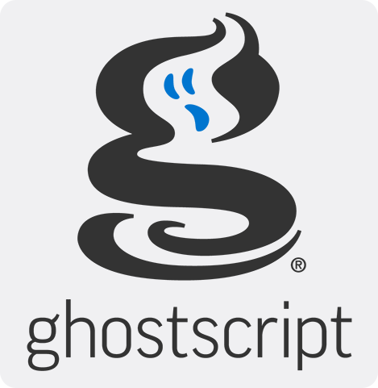

.. Copyright (C) 2001-2023 Artifex Software, Inc.
.. All Rights Reserved.

.. include:: header.rst

.. This is the TOC in the sidebar!

Welcome to :title:`Ghostscript`
================================

:title:`Ghostscript` is an interpreter for the `PostScript® <https://en.wikipedia.org/wiki/PostScript>`_ language and `PDF <https://en.wikipedia.org/wiki/PDF>`_ files. It is available under either the `GNU GPL Affero license <https://www.gnu.org/licenses/agpl-3.0.html>`_ or  `licensed for commercial <https://artifex.com/licensing/commercial?utm_source=rtd-ghostscript&utm_medium=rtd&utm_content=inline-link>`_ use from `Artifex Software, Inc <https://artifex.com/?utm_source=rtd-ghostscript&utm_medium=rtd&utm_content=inline-link>`_. It has been under active development for over 30 years and has been ported to several different systems during this time. Ghostscript consists of a PostScript interpreter layer and a graphics library.

|

----

.. toctree::
   :caption: About
   :maxdepth: 1

   Readme.rst
   News.rst
   ReleaseDates.rst

.. toctree::
   :caption: Ghostscript User Guide
   :maxdepth: 1

   Make.rst
   Install.rst
   Use.rst

.. toctree::
   :caption: Developing with Ghostscript
   :maxdepth: 1

   Develop.rst
   API.rst
   Lib.rst
   LanguageBindings.rst
   Language.rst
   thirdparty.rst

.. toctree::
   :caption: Devices
   :maxdepth: 1

   Devices.rst
   VectorDevices.rst
   Drivers.rst
   UnsupportedDevices.rst
   SampleDownscaleDevice.rst

.. toctree::
   :caption: Coding Guidelines
   :maxdepth: 1

   Source.rst
   C-style.rst
   Ps-style.rst

.. toctree::
   :caption: Other
   :maxdepth: 1

   Ghostscript-Enterprise.rst
   GPDL.rst
   Ps2epsi.rst
   Psfiles.rst
   Fonts.rst
   GhostscriptColorManagement.rst
   Unix-lpr.rst

.. include:: footer.rst

